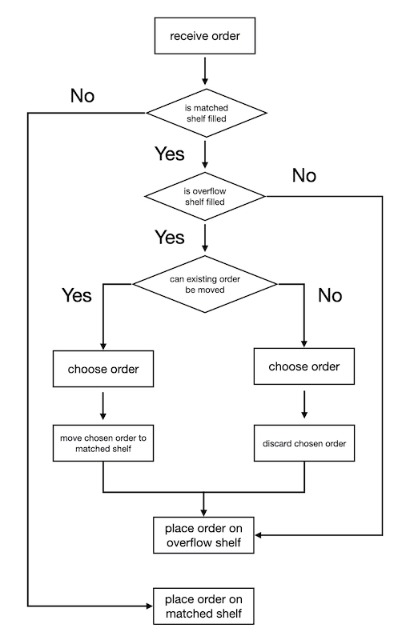
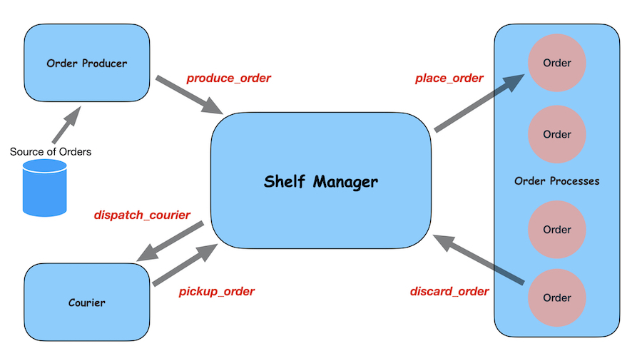

# Orders Simulation Homework

## Setup Local Environment:

- Host OS: (recommand using [asdf](https://asdf-vm.com/#/core-manage-asdf) to install Erlang & Elixir)

  setup Erlang:

      asdf install erlang latest

      asdf global erlang 23.1.2

  setup Elixir:

      asdf install elixir latest

      asdf global elixir 1.11.2-otp-23

  install deps: `make boot`

  run programe: `make run`

  run quick validation: `make sample`

  run quick validation without dispatching courier: `make nodispatch`

  run tests: `make test`

  show readme: `make readme`

- Docker:
  
  pull docker image: `make -f Makefile.docker.mk pull`

  build docker image: `make -f Makefile.docker.mk build_image`

  install deps: `make -f Makefile.docker.mk boot`
  
  run programe: `make -f Makefile.docker.mk run`

  run quick validation: `make -f Makefile.docker.mk sample`

  run quick validation without dispatching courier: `make -f Makefile.docker.mk nodispatch`

  run tests: `make -f Makefile.docker.mk test`

  show readme: `make -f Makefile.docker.mk readme`

## Q & A

- how and why you chose to handle moving orders to and from the
overflow shelf ?

  Detail of handle moving orders to and from the overflow shelf is shown in the program flow chart.

  

  The "choose order" section has two implementation: choose order randomly (lib/shelf/manager.ex#L340) or choose the lowest value order ((lib/shelf/manager.ex#L342)). The random method is used by default. However, choose the lowest value may make more sense.
  
## Overview

Orders Simulation (OS) writtern in Elixir.

### Architecture Diagram

### Details

After starting application, OS supervisor will create four process:

  - OS.Courier

    A [Task](https://hexdocs.pm/elixir/Task.html) module used to execute courier task asynchronously.

  - OS.OrderSupervisor

    A [DynamicSupervisor](https://hexdocs.pm/elixir/DynamicSupervisor.html) module used to start single order process dynamically.

    Single order (OS.Order) is implemented with GenServer to maintain respective isolation states of orders.

  - OS.ShelfSupervisor

    A [Supervisor](https://hexdocs.pm/elixir/Supervisor.html) module used to start shelf manager process.

    Shelf manager process is a core process implemented with GenServer to maintain all state of shelves.

  - OS.OrderProducer

    A [Task](https://hexdocs.pm/elixir/Task.html) module used to produce orders.

### Core Data Structure

State of OS.ShelfManager 

    %{
      producer_state: :running,

      # all orders on shelves
      orders: %{order_id: %{pid_name: {}, value: value}},

      # detail of shelves
      shelves: %{
        "HotShelf": %{
          orders: []
        },
        "ColdShelf": %{},
        ...
        "OverflowShelf": %{
          name: "OverflowShelf"
          temperature: "Overflow",
          capacity: 10,
          orders: [],
          "Hot": [],
          "Frozen": [],
          "Cold": [],
        }
      }
    }

### Core API

OS.ShelfManager

  - place_orders
  - pickup_order
  - discard_order
  - update_producer_state
  - get_shelves
  - get_shelf
  - get_orders
  - get_order
  - get_producer_state

OS.Order

  - update_placed_at
  - update_shelf_name
  - update_shelf_life
  - update_value
  - discard_order
  - get_value
  - get_shelf_name
  - get_shelf_life
  - get_placed_at

## Others

- After moving order from overflow shelf to matched shelf, update shelfLife and orderAge of order, then recaculate order value. (lib/shelf/manager.ex#L415)
